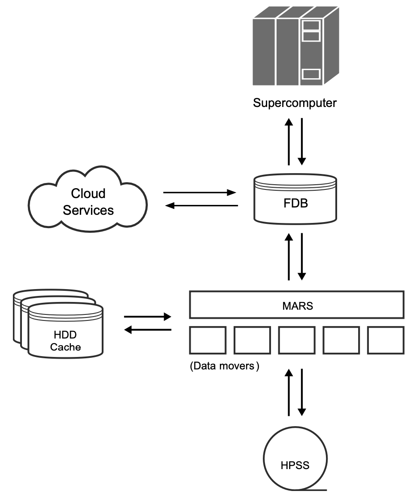

.. _schema-fdb-operational:

Introduction
============

Numerical weather prediction (NWP) and climate simulations are data heavy applications. 
Over the course of the last 40 years data output has increased by several orders 
of magnitude and are projected to continue. In 1995 ECMWF generated a total of
14 TiB per year, whereas the ensemble forecast output at the end of 2023 
totaled 60 TiB in just one hour.

The corresponding processing (archival, as well as archiving) of all output data,
are I/O intense operations, putting stress on all involved systems. Additionally weather 
forecasts decay in value rapidly after their creation (being superseded by newer
forecasts). There is a huge need to make this generated data available quickly and
cheaply for a general lifetime of the forecast data, which is typically 3 - 5 days.

The **Fields DataBase (FDB)** is a domain-specific object store developed at ECMWF for storing,
indexing and retrieving GRIB data, therefore playing the essential role of a hot-cache in
the context of NWP. 

.. Each GRIB message is stored as a field and indexed
.. trough semantic metadata (i.e. physical variables such as temperature, pressure, ...).
.. A set of fields can be retrieved specifying a request using a specific language 
.. developed for accessing :doc:`mars` Archive
