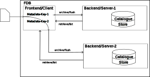

.. _label-architectural-overview:

Architectural overview
######################

As typical for a modern application, architectural choices have been made to isolate
parts of the FDB, which have specific use-cases. The main driver in that decision was
to split the FDB into a user-facing module, called the **frontend** or **client** and
a storage-facing module, called **backend** or **server**.
The FDB offers different *frontends* 
to implement different use case, e.g whether a FDB instance should run with a local
storage attached or the `routing` of data should be forwarded to several FDB instances.
The implemented *backends* are the backbone of the application, handling
how storage/retrieval operations should take place.
Also depending on the storage system, which will accommodate the **catalogue** and the **store**,
there are different implementations for the backend, dealing with technical details
which needs to be considered for different underlying storage systems.

.. _schema_fdb_frontend_backend:

This schematic shows the design of the FDB, especially the difference between the client and server side.

.. _architecture_frontend:

Frontend / Client
-----------------

The Frontend can be thought of as a client, connecting to the implementation of
the backend, dealing with all possible requests a user can have. There are typically
four operations (aside from some administrative function) a frontend needs to implement 
to be able to communicate with a configured
backend:

* `archive()`
  Archive a given dataset.
* `flush()`
  Guarantee that all data is stored accordingly.
* `retrieve()`
  Retrieve stored data specified by a given key (or metadata)
* `list()`
  List all (or all partially matched data, given a key) stored in the FDB

The FDB adheres to the ACID principle. Data is either visible (and therefore correctly stored)
or not, so operations are **transactional**. Furthermore, the aforementioned functions have the following properties:

* `archive()` blocks until data is transferred from the frontend to the backend
  of the FDB - **Asynchrounous**
* `flush()` blocks until data is made visible from the backend, so the data has
  been persisted - **Consistent**
* All operations are appending to the storage without altering already stored
  data (even if it has the identical metadata) - **Immutable**
* In case of identical metadata the already existing version is masked by the new
  one - **Versioned**

There are several frontend implementations, each of which can be used to achieve 
different use-cases:

**Local**-Frontend
******************

  Implements the passage from frontend to the storage backend. Originally
  intended to have a *local* FDB instance. With the newest changes in modularity
  and the corresponding configuration options the backend could also be *non-local*.

  **Schematic of a local FDB instance**:

**Remote**-Frontend
*******************

  Handles access to a remote FDB via TCP/IP. Talks to the FDB backend using
  asynchronous protocol (versioned). The schema, which is used for indexing of data,
  is taken from the server side.

  **Schematic of a remote FDB instance**:

**Distribute**-Frontend
***********************
  
  Implements multi-lane access to multiple FDB's which uses Rendez-vous Hashing to
  avoid synchronizations. The schematic below shows two different FDB server, which are
  used for data persistence. In general there could be several.

  **Schematic of a distributed FDB instance**:

**Select**-Frontend
*******************

  Dispatches requests to different FDB's based on the metadata of the associated data.
  A typical use case is to split data depending on its metadata. In the schematic
  below a splitting only occurs on the same machine. In general the data which should
  be stored could also be sent to a remote FDB instance (or a mixture of multiple local/remote FDBs).

  **Schematic of a selection FDB instance**:

Backend / Server
----------------

As seen in :ref:`schema-fdb-operational`, the FDB needs to compensate with two
kind of data flows:

1. Data needs to be efficiently streamed out of the NWP model (or other data
   producers) and stored.
2. The data location needs to be associated with a key and indexed, making the data
   available for retrieval processes.

The FDB consists out of two different backend components, handling the two 
aforementioned scenarios:

* The **Catalogue** which handles the metadata-based indexing
* The **Store** which handles the persisting of streamed data

Indexing and storing the data needs substantial effort. There are 
several aspects one need to keep in mind:

* **Performance of the system**

  The indexing scheme heavily influence the overall performance of the system.
  Depending on the chosen data layout reading (and/or writing) to the storage
  can be affected. In NWP the access pattern of post-processing consumers often
  differs from the optimal write pattern which should be chosen to guarantee
  optimal writing performance. Choosing the right layout (with all aspects like
  collocation etc.) is therefore a non-trival task.

* **Distribution of the backend modules**

  Due the modular nature of the FDB, it's perfectly viable to separate the Catalogue
  and the Store, e.g. deploying them to different systems. The design of splitting indexing
  as well as storage therefore needs to be considered thoroughly. How the splitting
  is done depends on many characteristics of the underlying systems, especially
  whether the storage is homogeneous or heterogeneous, or its bandwidth.

Similar to the frontends there are several implementations for the backend, so individual
implementation for the catalogue and the store. Those are namely:

* **Catalogue**

   * **POSIX (aka Toc)**

   * **PostgreSQL (under development)**

   * **Intel DAOS (under development)**

* **Store**

   * **POSIX (aka Toc)**
   
   * **Ceph**

   * **Intel DAOS (under development)**

